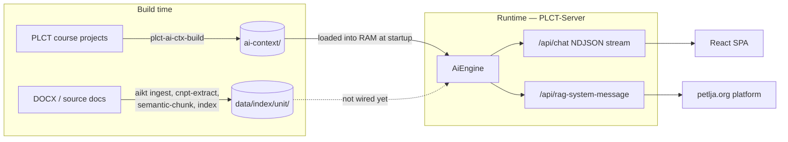
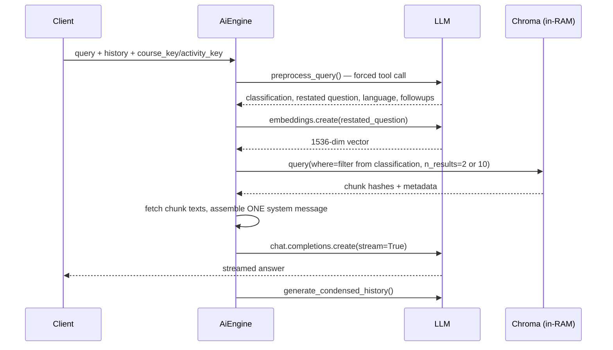

# PLCT Server — Architecture (current state)

This document describes what exists **today**, across the three repositories that together
produce and serve the Petlja AI assistant. It is a snapshot for orientation, not a proposal.
The proposal lives in [plan.md](plan.md).

Status: PLCT-Server `0.3.5`, branch `release/0.4.x`.

---

## 1. The three repositories

| Repo | Phase | Produces | Consumed by |
| --- | --- | --- | --- |
| **PLCT-AI-Ctx** (`../net-kabinet/PLCT-AI-Ctx`) | build-time, offline | `ai-context/` dataset — course/lesson summaries, TOC, fixed-size chunks, precomputed embeddings | PLCT-Server at startup |
| **PLCT-Server** (this repo) | runtime | HTTP server: static course content, React SPA, chat API, RAG API | Browser, Petlja platform |
| **AI-Knowledge-Tools** (`../AI-Knowledge-Tools`) | build-time **and** reusable runtime library | `data/index/<unit>/` bundle + `KnowledgeBaseTool` Python class | not yet wired into PLCT-Server |



The dotted edge is the gap this release closes.

---

## 2. PLCT-Server runtime

### 2.1 Entry points and process model

| Entry point | Module | Routers |
| --- | --- | --- |
| `plct-serve` CLI | [cli_main.py:22](plct_server/cli_main.py#L22) | UI router only |
| ASGI `plct_server.ui_main:app` | [ui_main.py](plct_server/ui_main.py) | UI + RAG |
| ASGI `plct_server.rag_main:app` | [rag_main.py](plct_server/rag_main.py) | RAG only |
| `plct-batch-review` CLI | [cli_main.py:50](plct_server/cli_main.py#L50) | none — offline eval |

All of them funnel through one umbrella call, [`content.server.configure()`](plct_server/content/server.py#L197):

```
configure()
  ├── load_config()          # YAML file + CLI args + env vars → ConfigOptions
  ├── init_server_content()  # ServerContent singleton: courses, TOC
  └── init_ai_engine()       # AiClientFactory + AiEngine singleton (loads embeddings into RAM)
```

Both singletons are module-level globals with `get_server_content()` / `get_ai_engine()`
accessors that raise if `configure()` has not run. There is one `AiEngine` per process and it is
initialized eagerly — server startup blocks until the whole embedding set is in RAM.

### 2.2 Configuration

[`ConfigOptions`](plct_server/content/server.py#L26) is a `pydantic-settings` `BaseSettings` with
`env_prefix='plct_'`. Precedence: CLI option → YAML file → environment variable → default.

| Key | Meaning |
| --- | --- |
| `content_url` | Base URL/path that `course_paths` resolve against |
| `course_paths` | PLCT project folders to serve |
| `ai_ctx_url` | The PLCT-AI-Ctx dataset — **local path or HTTP base URL** |
| `api_key` | Shared secret for `/api/rag-system-message` (`X-Auth-Key` header) |
| `azure_default_ai_endpoint`, `vllm_url` | Provider endpoints |
| `verbose` | Log level |

API keys come only from the environment: `CHATAI_OPENAI_API_KEY`, `CHATAI_AZURE_API_KEY`,
`CHATAI_VLLM_API_KEY`. The presence of an Azure or OpenAI key selects the default provider.

### 2.3 Content layer

[`FileSet`](plct_server/content/fileset.py#L20) is the storage abstraction: `LocalFileSet` over a
directory, `HttpFileSet` over a base URL, chosen by `FileSet.from_base_url()`. It exposes
`read_str`, `read_json`, `read_yaml`, `read_bytes`, `subdir`, and `fastapi_response`. **Everything
that reads the AI context goes through this abstraction**, which is why `ai_ctx_url` can be an
Azure Blob URL in production.

`ServerContent` loads each PLCT project into a `CourseContent` with a `TocItem` tree, serving
`/api/courses`, `/api/toc-item`, `/api/toc-list`.

### 2.4 Model access

[`AiClientFactory`](plct_server/ai/client.py#L9) returns an `AsyncOpenAI` or `AsyncAzureOpenAI`
per `ModelConfig`. Three providers: `OPENAI`, `AZURE`, `VLLM`.
[`MODEL_CONFIGS_LIST`](plct_server/ai/model_conf.py#L20) is the static registry; vLLM models are
additionally **auto-discovered** at startup via `models.list()`, reading `max_model_len` off the
vLLM extension field. Every model config carries `context_size`, which the engine enforces with
tiktoken before each request.

Everything is **async** and the final answer is **streamed** via Chat Completions.

### 2.5 The AI context dataset in RAM

[`ContextDataset`](plct_server/ai/context_dataset.py#L170) is a thin reader over the FileSet. At
startup [`AiEngine._load_embeddings()`](plct_server/ai/engine.py#L113):

1. reads `emb-text-embedding-3-large-1536.json.zst` as one blob,
2. decompresses it entirely into a Python string, then `json.loads` it,
3. batch-inserts ids + vectors + metadata into a single in-process Chroma collection named
   `text-embedding-3-large-1536` with `hnsw:space: "ip"`.

The Chroma client is `chromadb.Client(Settings(anonymized_telemetry=False))` — in-memory,
non-persistent, created inside `AiEngine.__init__`. Chunk **text** is not held in RAM; only
vectors and metadata are. Text is fetched per hit through `get_chunk_text(chunk_hash)`, which
reads `chunks/<hh>/<sha256>.txt` from the FileSet (an HTTP GET in production).

### 2.6 The current query path

This is the "2023 harness": a fixed, three-call pipeline with one retrieval step.



The classification decides both the metadata filter and the result count
([`_generate_chroma_filter`](plct_server/ai/engine.py#L196)):

| Classification | Chroma `where` | `n_results` | Summary block injected |
| --- | --- | --- | --- |
| `course` | `{course_key}` | 2 | course summary + TOC |
| `current_lecture` | `{course_key, activity_key}` | 10 | lesson summary |
| `platform` | `{course_key: "petlja-docs"}` | 2 | fixed platform text |
| `unsure` | — (no retrieval) | 0 | course + lesson summary + general-CS allowance |

`make_system_message()` then concatenates: base template + summary segment + condensed-history
segment + RAG segment. Prompts live as plain format strings in
[prompt_templates.py](plct_server/ai/prompt_templates.py).

`QueryContext` ([query_context.py](plct_server/ai/query_context.py)) records per-part token counts
and chunk metadata for the batch-review reports.

### 2.7 API surfaces

**`/api/chat`** — [ui_api.py:128](plct_server/endpoints/ui_api.py#L128). POST, no auth, returns
`application/x-ndjson`. One JSON object per line, produced by a background task feeding an
`asyncio.Queue`. The event union is mirrored in the front-end at
[chatStream.ts:1](front-app/src/chatStream.ts#L1):

```ts
{ type: "progress"; stage: string; message: string }
{ type: "metadata"; condensed_history: string; followup_questions: string[] }
{ type: "content"; text: string }
{ type: "error"; message: string }
{ type: "done" }
```

Progress stages are a closed set with Serbian labels in
[`PROGRESS_MESSAGES`](plct_server/endpoints/ui_api.py#L34): `classifying`, `embedding`,
`retrieving`, `preparing_answer`, `condensing_history`, `generating_answer`. **The stage names are
the harness's internal steps leaking into the wire protocol** — publishing a stage that is not in
the dict raises `KeyError`.

**`/api/rag-system-message`** — [rag_api.py:38](plct_server/endpoints/rag_api.py#L38). POST,
`X-Auth-Key` authenticated. It does **not** answer. It returns the assembled system message plus
the condensed history and followups, and the **caller** (the petlja.org platform) runs the LLM
itself. This shape only works because retrieval today is a single non-iterative step.

**Static + SPA** — [pages.py](plct_server/endpoints/pages.py) serves course content and the React
build copied into `plct_server/front-app/build`.

### 2.8 Evaluation

`plct-batch-review` replays JSON "conversations" (history + query + course/activity keys) through
the engine and renders an HTML diff report against benchmark answers, optionally scoring
similarity with an LLM ([eval/batch_review.py](plct_server/eval/batch_review.py)). This is the
existing regression net for prompt and retrieval changes.

---

## 3. PLCT-AI-Ctx — the course knowledge source

Build-time only. `plct-ai-ctx-build` walks PLCT course projects and writes the dataset that
`ContextDataset` reads. Layout:

```text
ai-context/
  index.json                          # { courses: [...], emb_types: [...] }
  <course_key>/
    summary.json                      # CourseSummary: title, summary path, toc path, activities{}
    summaries/course-summary.txt
    summaries/course-toc.txt
    summaries/<activity>.txt
  chunks/<hh>/<sha256>.txt            # chunk text
  chunks/<hh>/<sha256>.json           # ChunkMetadata
  chunks/<hh>/<sha256>-<model>-<size>.json
  emb-<model>-<size>.json.zst         # { ids, embeddings, metadatas } — the startup payload
```

`ChunkMetadata` is `course_key`, `activity_key`, `course_title`, `lesson_title`, `activity_title`
— these are exactly the fields available as Chroma filters.

Chunking is **fixed-size with overlap** (`chunk_size: 3072`, `chunk_overlap: 1524` in the sample
config) via `langchain-experimental`. Chunk identity is `sha256(course_key + "\n" + text)`, which
makes rebuilds incremental: unchanged text keeps its hash and its cached embedding.

The writer half, `ContextDatasetBuilder`, lives in **this** repo
([context_dataset.py:36](plct_server/ai/context_dataset.py#L36)) — PLCT-AI-Ctx depends on
PLCT-Server, not the other way around.

---

## 4. AI-Knowledge-Tools — the new knowledge source

A separate, product-neutral pipeline plus a reusable retrieval/answering library.

### 4.1 Pipeline and artifacts

```text
aikt ingest          DOCX → data/ingested/<unit>.md  (+ _media/, _interim/)
aikt cnpt-extract    <unit>.md → <unit>_concepts.json     # canonical concept inventory, UUIDv5 ids
aikt semantic-chunk  <unit>.md + concepts → <unit>_chunks.json
aikt index           concepts + chunks → data/index/<unit>/
aikt retrieve        inspect the bundle
aikt ask             answer a question through the tool loop
```

The prepared bundle:

```text
data/index/<unit>/
  manifest.json       # embedding_model, embedding_dimensions, counts, source paths
  records.jsonl       # one line per vector record: {id, kind: concept|chunk, embedding, metadata}
  chunks/0001.json    # chunk metadata, neighbour links, no text
  chunks/0001.md      # verbatim chunk text
```

Real reference bundle (`Handbook-for-Teachers`): 146 concepts, 122 chunks, 268 records,
`text-embedding-3-small` @ 1536 dims, **8.1 MB `records.jsonl`**.

Two properties matter for integration:

- **Source-preserving chunking.** Concatenating chunk texts in ordinal order reproduces the source
  byte for byte. Chunks carry `heading_path`, `content_type`, `token_count`, source line range,
  and `previous/next_chunk_id` — so a neighbour is `ordinal ± 1`.
- **A concept layer.** Concepts are vectors too. A concept hit can be *inverted* to the chunks
  assigned to it, which is a second retrieval path that fixed-size chunking has no equivalent of.

### 4.2 Reusable runtime library

| Function / class | Role | Notes |
| --- | --- | --- |
| `build_index_session` | loads a bundle into an ephemeral Chroma collection | **accepts an injected `chroma_client`**; issues no embedding request, so it works without an API key |
| `IndexSession` | the loaded bundle: manifest, `records_by_id`, collection, lazy `_lookups` | collection name is `aikt-retrieval-<uuid4>` — several sessions can share one client |
| `query_index_session` | embeds one query, searches, returns ranked hits | **accepts an injected `embeddings_create`**; cosine distance; `where={"kind": ...}` |
| `session_catalog`, `session_chunk`, `session_concept_chunk_ids`, `read_chunk_text` | deterministic lookups over loaded records | no requests |
| `KnowledgeBaseTool` | the `query_knowledge_base` tool | self-describing: its `description` embeds the full concept list and tells the model which language to query in |
| `answer_question` | the local tool loop that exercises it | seeds evidence, bounded rounds, strict JSON answer schema |

`KnowledgeBaseTool` owns an **evidence ledger**: chunk text is deduplicated across every call and
bounded by `max_evidence_tokens` using the `token_count` metadata. Already-delivered chunks come
back as `{"status": "already_provided"}` instead of repeated text. Adjacent ordinals are merged
into one passage before returning. Recoverable problems (empty retrieval, budget exhausted) are
returned to the model **as tool data, not raised**.

The tool takes `questions: string[]` — a batch — so one round can gather evidence for several
subtopics with cross-question deduplication.

### 4.3 Shape mismatches with PLCT-Server

These are facts, not judgements — they define the integration work.

| | PLCT-Server | AI-Knowledge-Tools |
| --- | --- | --- |
| Concurrency | async throughout (`AsyncOpenAI`, FastAPI streaming) | synchronous (`OpenAI().embeddings.create`, `.responses.create`) |
| Model API | Chat Completions, streamed | Responses API, non-streamed |
| Tool definition shape | `{"type":"function","function":{...}}` | `{"type":"function","name":...}` (Responses flat form) |
| Provider | OpenAI / Azure / vLLM via `AiClientFactory` | OpenAI only, unless a callable is injected |
| Vector distance | inner product (`ip`) | cosine |
| Embedding model | `text-embedding-3-large` @ 1536 | whatever the manifest records (`text-embedding-3-small` @ 1536 in the reference bundle) |
| Storage access | `FileSet` — local **or HTTP** | `pathlib.Path` — **local filesystem only** |
| Text residency | chunk text fetched per hit, over HTTP | chunk `.md` read from disk per hit |
| Retrieval control | server picks the filter from a classification | model asks natural-language questions and iterates |

Note also that `query_index_session` validates the returned embedding length against the manifest
but never sends `dimensions` — so a `-large` bundle would be 3072-dim unless the injected callable
supplies `dimensions` itself. Both `aikt index` and `query_index_session` accept an injected
`embeddings_create`, so this is controllable from the host without forking.

---

## 5. Constraints any integration has to respect

1. **One process, eager startup.** Both knowledge sources must load into RAM before the server
   accepts traffic, or startup must become lazy/streamed.
2. **`FileSet` is the deployment contract.** Production reads the AI context over HTTPS from blob
   storage. AIKT bundles currently assume a local path.
3. **Three providers, not one.** Anything that reaches a model must go through `AiClientFactory`,
   or Azure and vLLM deployments break.
4. **Streaming is the product.** The final answer streams token by token; only the tool-calling
   rounds before it can be non-streamed.
5. **`/api/rag-system-message` has an external consumer.** The petlja.org platform runs the model
   itself against a precomputed system message. An iterative harness cannot produce one up front.
6. **The progress protocol is shared with the front-end.** `PROGRESS_MESSAGES` and the `ChatEvent`
   union in `chatStream.ts` must change together.
