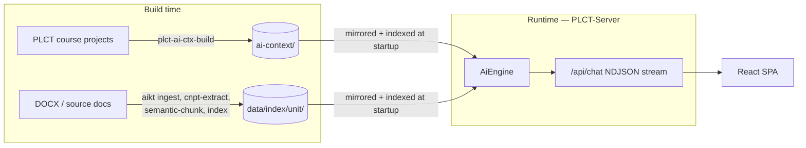
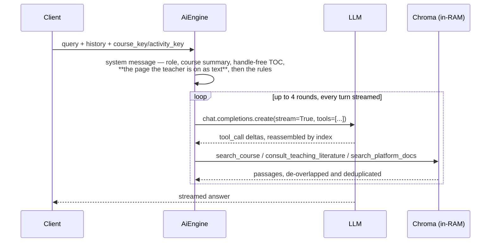

# PLCT Server — Runtime and Query Flow

How a question becomes an answer inside this repo: what starts the process, what is loaded
before it accepts traffic, and what happens between `/api/chat` receiving a query and the
first token going back out.

This is a snapshot of what exists **today**, not a proposal. For what the two upstream
repositories hand this one, see [PLCT-AI-Ctx relations](plct_ai_ctx_relations.md) and
[AI-Knowledge-Tools relations](ai_knowledge_tools_relations.md).

Status: PLCT-Server `0.3.5`, branch `release/0.4.x`. The 2023 classifier harness has been
retired: routing is now a tool loop over both knowledge layers, and `/api/rag-system-message`
is gone.

---

## 1. Where this repo sits

| Repo | Phase | Produces | Consumed by |
| --- | --- | --- | --- |
| **PLCT-AI-Ctx** (`../net-kabinet/PLCT-AI-Ctx`) | build-time, offline | `ai-context/` dataset — course/lesson summaries, TOC, fixed-size chunks, precomputed embeddings | PLCT-Server at startup |
| **PLCT-Server** (this repo) | runtime | HTTP server: static course content, React SPA, chat API | Browser, Petlja platform |
| **AI-Knowledge-Tools** (`../AI-Knowledge-Tools`) | build-time **and** reusable runtime library | `data/index/<unit>/` bundle + `KnowledgeBaseTool` Python class | PLCT-Server loads the bundle; the tool's *strategy* is ported, not imported |



Both layers are reachable from one answer; `/api/rag-system-message` has been deleted, so
`/api/chat` is the only path and the server owns the whole loop.

Note the dependency direction on the left-hand branch: `ContextDatasetBuilder`, the writer of
the `ai-context/` format, lives in **this** repo — PLCT-AI-Ctx depends on PLCT-Server, not the
other way around. AIKT has no dependency in either direction; only its artifacts cross.

## 2. Entry points and process model

| Entry point | Module | Routers |
| --- | --- | --- |
| `plct-serve` CLI | [cli_main.py:22](../plct_server/cli_main.py#L22) | UI router only |
| ASGI `plct_server.ui_main:app` | [ui_main.py](../plct_server/ui_main.py) | UI |
| `plct-batch-review` CLI | [cli_main.py:50](../plct_server/cli_main.py#L50) | none — offline eval |

All of them funnel through one umbrella call, [`content.server.configure()`](../plct_server/content/server.py#L197):

```
configure()
  ├── load_config()          # YAML file + CLI args + env vars → ConfigOptions
  ├── init_server_content()  # ServerContent singleton: courses, TOC
  └── init_ai_engine()       # AiClientFactory + AiEngine singleton (loads embeddings into RAM)
```

Both singletons are module-level globals with `get_server_content()` / `get_ai_engine()`
accessors that raise if `configure()` has not run. There is one `AiEngine` per process and it is
initialized eagerly — server startup blocks until the whole embedding set is in RAM.

## 3. Configuration

[`ConfigOptions`](../plct_server/content/server.py#L26) is a `pydantic-settings` `BaseSettings` with
`env_prefix='plct_'`. Precedence: CLI option → YAML file → environment variable → default.
Full reference in [config.md](config.md).

| Key | Meaning |
| --- | --- |
| `content_url` | Base URL/path that `course_paths` resolve against |
| `course_paths` | PLCT project folders to serve |
| `ai_ctx_url` | The PLCT-AI-Ctx dataset — **local path or HTTP base URL** |
| `knowledge_sources`, `knowledge_cache_dir` | Every indexed body of knowledge, and where it is mirrored |
| `api_key` | Retired with `/api/rag-system-message`; still accepted so deployed config files keep loading, and warned about at startup |
| `azure_default_ai_endpoint`, `vllm_url` | Provider endpoints |
| `verbose` | Log level |

API keys come only from the environment: `CHATAI_OPENAI_API_KEY`, `CHATAI_AZURE_API_KEY`,
`CHATAI_VLLM_API_KEY`. The presence of an Azure or OpenAI key selects the default provider.

## 4. Content layer

[`FileSet`](../plct_server/content/fileset.py#L20) is the storage abstraction: `LocalFileSet` over a
directory, `HttpFileSet` over a base URL, chosen by `FileSet.from_base_url()`. It exposes
`read_str`, `read_json`, `read_yaml`, `read_bytes`, `subdir`, and `fastapi_response`. **Everything
that reads the AI context goes through this abstraction**, which is why `ai_ctx_url` can be an
Azure Blob URL in production.

`ServerContent` loads each PLCT project into a `CourseContent` with a `TocItem` tree, serving
`/api/courses`, `/api/toc-item`, `/api/toc-list`.

## 5. Model access

[`AiClientFactory`](../plct_server/ai/client.py#L9) returns an `AsyncOpenAI` or `AsyncAzureOpenAI`
per `ModelConfig`. Three providers: `OPENAI`, `AZURE`, `VLLM`.
[`MODEL_CONFIGS_LIST`](../plct_server/ai/model_conf.py#L20) is the static registry; vLLM models are
additionally **auto-discovered** at startup via `models.list()`, reading `max_model_len` off the
vLLM extension field. Every model config carries `context_size`, which the engine enforces
before each request, and `encoding` — the tiktoken encoding that model tokenizes with, so
the count is taken in its own units (`cl100k_base` for `text-embedding-3-*`, `o200k_base`
for the OpenAI chat models). A vLLM model leaves it unset and is counted with
`FALLBACK_ENCODING`, an estimate that runs low on Cyrillic.

Everything is **async** and the final answer is **streamed** via Chat Completions.

## 6. The knowledge layer at startup

[`plct_server/knowledge/`](../plct_server/knowledge/) mirrors every configured source to
`<knowledge_cache_dir>/<source-key>-<url-hash>/` and loads each into **its own** Chroma
collection, so the course dataset (`text-embedding-3-large`@1536, inner product) and an AIKT
bundle (`text-embedding-3-small`@1536, cosine) coexist in one in-memory client with no
coupling. `store.source(key)` hands back one source; there is deliberately no `search_all()`.

Chunk **text** is not held in RAM; only vectors and metadata are. Text is read per hit from
the local mirror, which is also why the text matches the dataset's own hashes: the files were
written on Windows with CRLF and a local read translates them back to LF, while an HTTP read
does not.

On top of the course collection, [`course_db`](../plct_server/knowledge/course_db.py) reconstructs
the two things that dataset does not record — document order and lessons. That reconstruction
is a property of the PLCT-AI-Ctx contract and is described in
[plct_ai_ctx_relations.md](plct_ai_ctx_relations.md).

## 7. The query path

A tool loop. There is no classifier, no routing label, and no pre-baked system message: the
server assembles one frame and the model asks for what it needs.



The first turn that emits content *is* the answer, streamed as it arrives — so a question
the page in the prompt already covers costs one request, and one needing evidence costs two.

### 7.1 The frame: the page the teacher is on

**The page the teacher is on goes into the prompt as text, not as its summary**
([`current_page`](../plct_server/ai/tools/course_tools.py)). Up to `CONTEXT_MAX_CHUNKS` (3) it
goes in whole, which needs no embedding at all — 95% of pages. A longer page is searched
with the teacher's own question for the same number of chunks, runs that turn out to be
adjacent are fused, and the prompt says plainly that it is a sample of N sections. Because
the median activity is a single chunk, the median context is ~3,000 tokens whatever the cap
is set to; the cap only bounds the tail. It is deliberately tighter than the tool's widening
cap of 8, because this is paid on every request and that is paid only when the model asks.

Everything the prompt delivers is booked through the same evidence ledger the tools use, so
a later tool call landing on the same page reports it as already provided.

Order within the system message is load-bearing: role, then the material, then the rules.
With the rules first, the last thing the model read before the question was a few thousand
tokens of Serbian lesson prose, and over repeated runs the pedagogy layer went unconsulted
on questions that plainly needed it.

### 7.2 The three tools

The tools ([ai/tools/](../plct_server/ai/tools/)) are all shaped the same way, after AIKT's
`query_knowledge_base`: the only parameter is `questions: string[]`, and the model never sees
an id, a ref, an ordinal, a `k` or a scope flag. Routing is which tool it picks, so each
description states its own coverage.

| Tool | Covers | Notes |
| --- | --- | --- |
| `search_course` | the course the teacher is in | `k=6` per question, cut off at `max_distance`, plus a second pass filtered to the page the teacher is on (same vector, no second embedding) which is pinned first so it is never dropped; at most 5 activities per call, ranked by best distance |
| `consult_teaching_literature` | the `Handbook-for-Teachers` bundle | one tool per bundle, `k=5` chunks + 3 concepts per question (one vector, two filtered searches), each concept expanding to its 3 best-ranked chunks; each kind cut off at its own distance, then the call capped at `max_chunks` (12) in rank order |
| `search_platform_docs` | `course_key = "petlja-docs"` | same class as `search_course`, different course and description |

**A bundle's tool is bound to it by `knowledge_unit`**, the name its manifest declares —
`BUNDLE_TOOLS` in [knowledge_tools.py](../plct_server/ai/tools/knowledge_tools.py) maps that
name to what the server offers it as: tool name, description, and the label every passage is
cited with. AIKT prepares knowledge and does not describe it, so a description — which is
prompt engineering, calibrated against this model and against the sibling tools it competes
with — is authored here, beside those siblings. Binding on `knowledge_unit` rather than on
the config's source key means renaming a source cannot silently detach a tool from its
knowledge, and a loaded bundle that no tool offers **raises at startup**: indexed but
unreachable is the one failure nothing at runtime would report.

One bundle, one tool. A merged tool over several bundles has to describe itself by listing
what it holds, and a generated inventory is not a description a model routes on — the
earlier `query_knowledge_base` spelled out all 146 concept names, 942 tokens of nouns, and
that list is what the tool-ordering fix below was working around. The prose description that
replaced it is 206 tokens, in the same range as its two siblings (86 and 115).

Tool order and wording are both load-bearing, and both were found by measurement rather than
reasoning. The platform description once said "assignments and grading" and disclaimed
teaching practice in a negative sentence; the model read the noun, ignored the negation, and
sent every question about assessment to the platform docs. And with the literature tool
offered last, behind a description carrying a long concept list, the model reached for the
nearer tool instead of reading past it. Pedagogy is now offered before the platform docs, and
the platform description mentions neither assessment nor grading. The concept list is gone
too, so that second finding is worth re-measuring rather than assuming — `plct-batch-review`
is the net.

### 7.3 Cutoffs: a hit past the threshold is not returned at all

A vector search hands back its `k` nearest neighbours whether or not any of them answers the
question, so without a cutoff no question can fail: one the corpus cannot answer comes back
with the nearest unrelated pages, they are charged to the evidence budget, and they are
charged *before* a question that could have been answered. Refused hits are still logged,
marked `far`, because a threshold whose rejections are invisible cannot be recalibrated.

Every layer sets its own, because none of the scales transfer. The course layer is
text-embedding-3-large under inner product over normalised vectors, so cosine distance:
answers land under ~0.42, noise from ~0.47, `max_distance` **0.45**. The handbook bundle is
text-embedding-3-small, and within it a chunk hit and a concept hit are two more populations
— a concept vector is a short name, so it sits nearer any question by construction — hence
`max_chunk_distance` and `max_concept_distance`, both **0.46**. The page the teacher is on is
exempt from all of it: it is relevant by where they are standing rather than by distance, and
it is capped at `here_k` chunks either way.

**The literature call is then capped and ranked.** Five questions at `chunk_k=5`, each
expanding three concepts into three chunks, reach for 70 of the handbook's 122 chunks — one
observed call delivered ~25,000 tokens, 40% of the 62k-token corpus, and still overflowed the
budget twice. Worse, `_deliver` merges runs by ordinal, so *which* material the budget refused
was decided by document position rather than by relevance. Now the surviving hits are ranked
and `max_chunks` (12) taken off the top: direct hits by chunk distance first, chunks a matched
concept led to after, as two tiers rather than one merged ranking — the distances are not
comparable across kinds, and a chunk the question hit outright is the better evidence. On the
call above that is 12 chunks and ~6,500 tokens where it was ~49 and ~25,000, and the cutoff
alone accounts for 12,163 tokens of refused text.

A question whose every hit was refused is **named back to the model** — not "nothing matched",
but which of the questions it just sent found nothing, so it rewords that one instead of
re-asking it. Both tools say it in the same words ([`questions.too_far`](../plct_server/ai/tools/questions.py)),
because it is the same failure whichever corpus it happens in. The wording points at the usual
cause, which is a question about the material ("does this lesson already contain quiz
questions?") rather than about its subject matter: an existence question has no passage that
answers it, since answering *no* means reading the whole corpus and an index only ranks. The
same steer sits in the `questions` parameter description in
[questions.py](../plct_server/ai/tools/questions.py), where the model writes them.

### 7.4 Widening a course hit to its page

A course hit is **widened to its whole page** — in document order, with the build-time
overlap stripped via `course_db.reconstruct` — unless the page is one of the 26 (1.2%) too
large to read whole, in which case only the matched chunks come back, each as its own
passage and flagged `excerpt`. Those are the exercise pages: runs of unrelated algorithmic
tasks, up to 53 chunks, concentrated in a few specialist courses. Widening is also skipped
when the page will not fit the evidence budget still unspent, so the closest match widens
and later ones degrade rather than crowding out the pedagogy layer. Both bounds are one
comparison, in tokens: a page is widened when it costs no more than
`min(whole_page_max_tokens, evidence.remaining)`.

**How the two page caps were chosen.** Both were calibrated over the corpus rather than
picked. `whole_page_max_tokens` (`chunks_to_tokens(8)` = 13,908) is where the two kinds of
page separate — below it the excerpt path starts catching ordinary four- and six-chunk
lessons across most of the catalogue, which are coherent texts that deserve to arrive whole;
at 8 what is left is the exercise-task pages, in a handful of specialist courses:

| cap | delivered whole | excerpted | courses holding the tail |
| ---: | ---: | ---: | ---: |
| 3 | 2,099 (94.8%) | 116 | 25 |
| 5 | 2,163 (97.7%) | 52 | 16 |
| **8** | **2,189 (98.8%)** | **26** | **7** |
| 10 | 2,196 (99.1%) | 19 | 5 |

`CONTEXT_MAX_CHUNKS` (3) bounds only the tail, because the median activity is a single chunk
and a whole page tops out at ~13,900 tokens:

| cap | pages whole | context tokens: median / mean / p95 / worst |
| ---: | ---: | --- |
| 1 | 1,854 (84%) | 3,072 / 3,072 / 3,072 / 3,072 |
| **3** | **2,099 (95%)** | **3,072 / 3,468 / 6,168 / 6,168** |
| 8 | 2,189 (99%) | 3,072 / 3,684 / 7,716 / 13,908 |

### 7.5 The evidence ledger

A single per-request ledger ([tools/evidence.py](../plct_server/ai/tools/evidence.py)) is
shared by all three tools: text is deduplicated and bounded by a token budget across every
call, which is what stops a loop from filling its own context. Recoverable problems — empty
retrieval, spent budget, an already-delivered passage — are returned as tool data, never
raised.

A call returns **passages that carry text, and nothing else**. Material the model was already
given, and material the budget refused, are counted in the call's `note` instead of arriving
as text-free passages — so the model reads one shape, and every one of them is evidence.
Every passage is labelled with its lesson and activity title, so provenance reaches the model.

`ModelConfig.supports_tools` gates the whole thing: a model without it gets one no-tools turn
from the same system message.

## 8. API surfaces

**`/api/chat`** — [ui_api.py](../plct_server/endpoints/ui_api.py). POST, no auth, returns
`application/x-ndjson`. One JSON object per line, produced by a background task feeding an
`asyncio.Queue`. The event union is mirrored in the front-end at
[chatStream.ts:1](../front-app/src/chatStream.ts#L1):

```ts
{ type: "progress"; stage: string; message: string; detail?: string }
{ type: "content"; text: string }
{ type: "error"; message: string }
{ type: "done" }
```

Progress stages are a closed set with Serbian labels in
[`PROGRESS_MESSAGES`](../plct_server/endpoints/ui_api.py#L34) — now just `preparing_answer` and
`retrieving`, the latter published once per tool round with the round's tools as `detail`.
Publishing a stage that is not in the dict raises `KeyError`.

There is **no `metadata` event**: condensed history and follow-up questions were both
removed, so history round-trips raw and the suggestion chips fall back to their default set.

**Static + SPA** — [pages.py](../plct_server/endpoints/pages.py) serves course content and the
React build copied into `plct_server/front-app/build`.

## 9. Evaluation

`plct-batch-review` replays JSON "conversations" (history + query + course/activity keys) through
the engine and renders an HTML diff report against benchmark answers, optionally scoring
similarity with an LLM ([eval/batch_review.py](../plct_server/eval/batch_review.py)). This is the
existing regression net for prompt and retrieval changes. The report now shows one
`QueryContext` part per tool call and its result, so what the model actually saw is visible
rather than a single pre-baked string.

---

## 10. Constraints any integration has to respect

1. **One process, eager startup.** Both knowledge sources must load into RAM before the server
   accepts traffic, or startup must become lazy/streamed.
2. **`FileSet` is the deployment contract.** Production reads the AI context over HTTPS from blob
   storage. AIKT bundles currently assume a local path.
3. **Three providers, not one.** Anything that reaches a model must go through `AiClientFactory`,
   or Azure and vLLM deployments break.
4. **Streaming is the product.** The final answer streams token by token; only the tool-calling
   rounds before it can be non-streamed.
5. **The progress protocol is shared with the front-end.** `PROGRESS_MESSAGES` and the `ChatEvent`
   union in `chatStream.ts` must change together.
6. **Distance cutoffs do not transfer.** Each source sets its own, calibrated on its own
   embedding model and corpus; a shared threshold is a mis-calibration for at least one of them.
7. **`ConfigOptions` forbids extra keys, and a config that fails to validate is logged and
   replaced by defaults rather than raised.** Removing a config field therefore silently
   unconfigures every deployed server still carrying it — which is why `api_key` outlived
   the endpoint it belonged to.
